# 🎤 VoiceCal - AI Voice-Powered Calorie Tracker


VoiceCal is an innovative Flutter mobile application that revolutionizes calorie tracking through voice interactions. Say goodbye to tedious manual food logging - simply speak your meals and let AI handle the rest!

## 🌟 Features

- 🎙️ **Voice-First Experience**: Primary input method for meal logging
- 📊 **Smart Nutrition Tracking**: AI-powered food recognition and calorie calculation
- 🎯 **Personalized Goals**: Custom daily calorie and macro targets
- 📈 **Progress Analytics**: Historical data and insightful charts
- 🤝 **Social Integration**: Share progress and connect with community
- 🎨 **Premium iOS Design**: Beautiful, intuitive user interface

## 📱 Current Status: Onboarding Flow Complete

The app currently features a comprehensive onboarding system that collects user information to create personalized nutrition plans.

### 🚀 Onboarding Journey

#### 1. Welcome Screen
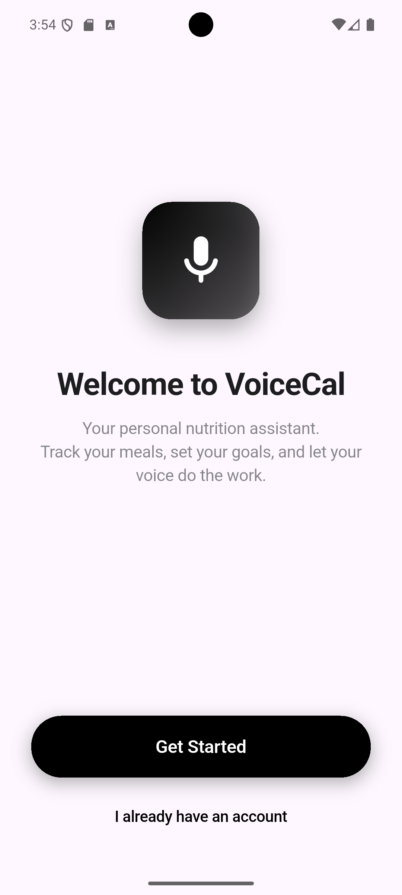

Premium iOS-style introduction with smooth animations and clear value proposition.

---

#### 2. Gender Selection
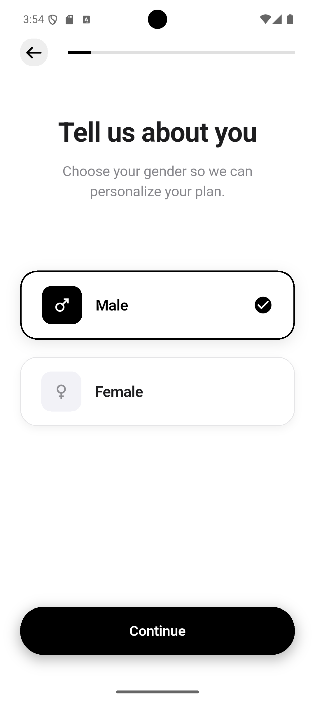

Clean, accessible gender selection with haptic feedback and smooth transitions.

---

#### 3. Age Selection
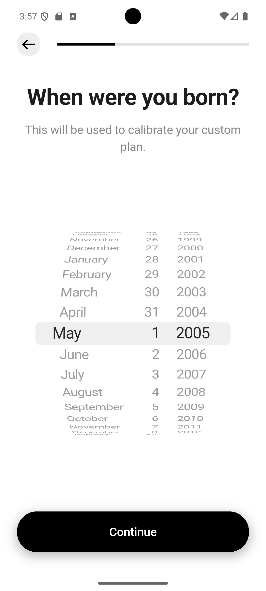

Interactive birth date picker with smooth scrolling and validation.

---

#### 4. Height & Weight
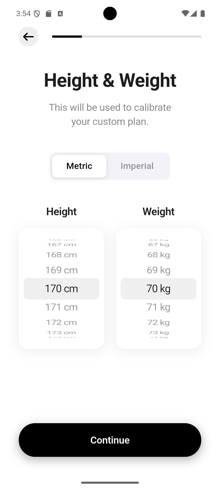

Dual picker interface supporting both metric and imperial units with real-time conversion.

---

#### 5. Activity Level
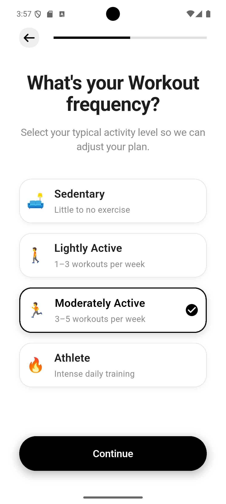

Visual activity level selection with clear descriptions and recommendations.

---

#### 6. Fitness Goals
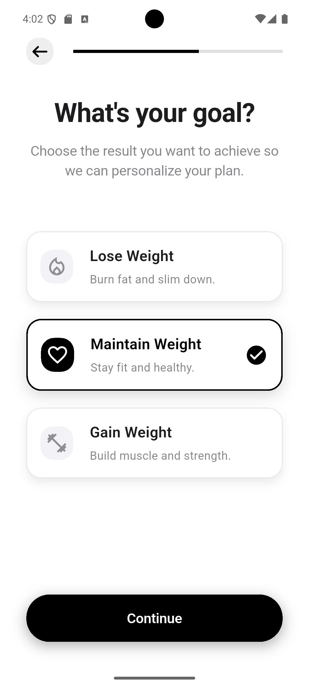

Comprehensive goal selection with detailed descriptions and visual icons.

---

#### 7. Target Weight
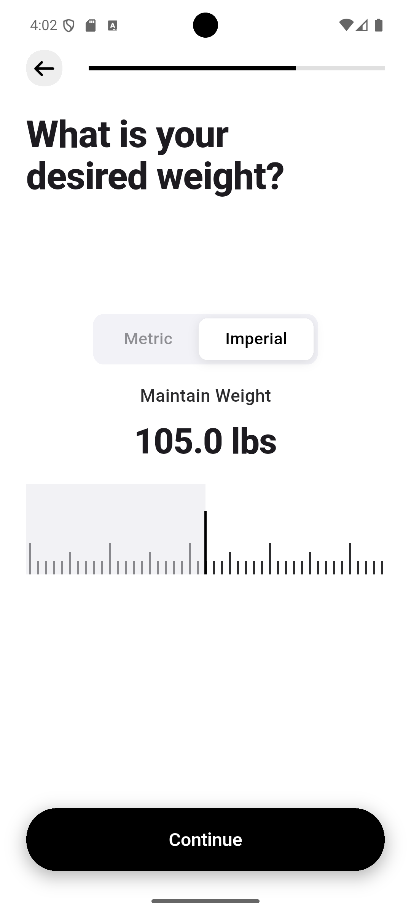

Smart weight goal setting with healthy range recommendations and visual feedback.

---

#### 8. Goal Timeline
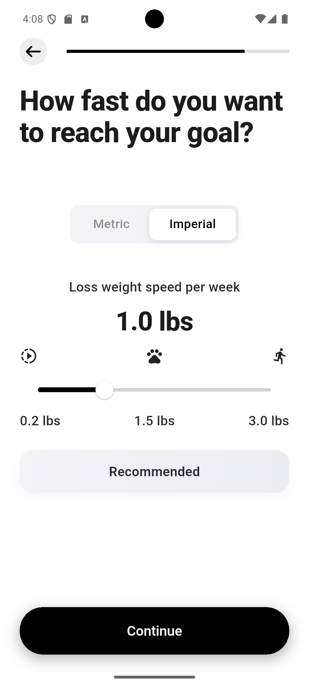

Interactive timeline slider with health-conscious speed recommendations and visual indicators.

---

#### 9. Calorie Rollover
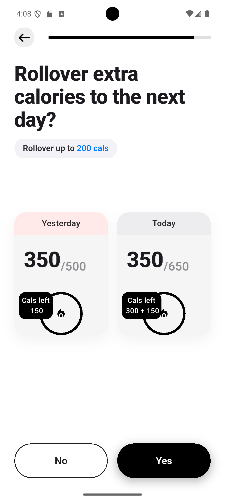

Advanced feature for managing unused calories with clear explanations and visual examples.

---

#### 10. Thank You Screen
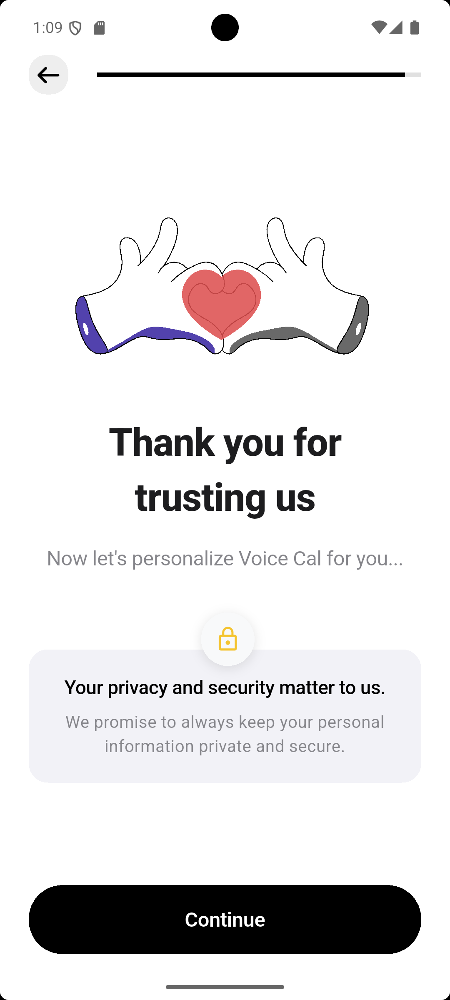

Congratulatory screen with privacy assurance and motivation before final plan generation.

---

#### 11. Results Loading
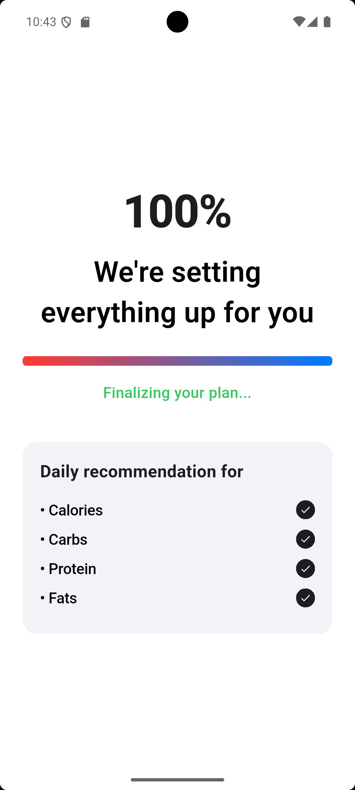

Animated loading screen with progress tracking and real-time calculation updates for nutrition plan generation.

---

#### 12. Personalized Results


Custom calorie and macro recommendations based on user profile with beautiful data visualization.

---

#### 13. Edit Goals
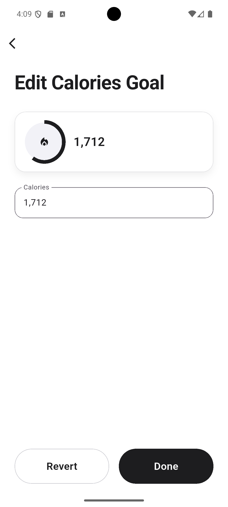

Flexible goal editing interface allowing users to adjust their targets anytime.

---

## 🏗️ Technical Architecture

### **Clean Architecture with Feature-Based Organization**

```
lib/
├── core/                    # Shared infrastructure
│   ├── di/                 # Dependency injection
│   ├── helpers/            # Utility functions & extensions
│   ├── networking/         # API clients & networking setup
│   ├── routing/            # Navigation configuration
│   ├── services/           # Business logic services
│   │   └── nutrition/      # Nutrition calculation engine ✅
│   ├── theme/              # App colors, typography, themes
│   └── widgets/            # Reusable UI components
└── features/               # Feature modules
    └── onboarding/         # User onboarding flow ✅
        ├── data/           # Models & repositories
        │   └── models/     # UserInformationsModel, GoalPlan, etc.
        └── presentation/   # Screens & widgets
            ├── screens/    # 13 onboarding screens + loading states
            └── widgets/    # Feature-specific components
```

### **Technology Stack**

- **🎯 State Management**: BLoC Pattern with flutter_bloc
- **🌐 Backend**: Firebase + Supabase integration
- **🔌 Networking**: Dio + Retrofit for type-safe APIs
- **💾 Storage**: Hive for local data + Flutter Secure Storage
- **📐 Responsive Design**: ScreenUtil (375x812 base)
- **🎨 UI/UX**: Custom iOS-style components with Lottie animations

### **Multi-Flavor Support**

- **Development**: `com.example.voicecal.dev`
- **Production**: `com.example.voicecal`

## 🚀 Getting Started

### Prerequisites

- Flutter SDK (^3.9.0)
- Dart SDK
- Android Studio / VS Code
- Firebase CLI (for backend integration)

### Installation

1. **Clone the repository**
   ```bash
   git clone https://github.com/zyaddmostafa/VoiceCal.git
   cd VoiceCal
   ```

2. **Install dependencies**
   ```bash
   flutter pub get
   ```

3. **Generate code**
   ```bash
   flutter packages pub run build_runner build
   ```

4. **Run the app**
   ```bash
   # Development flavor
   flutter run --flavor development --target lib/main_development.dart
   
   # Production flavor
   flutter run --flavor production --target lib/main_production.dart
   ```

## 🏗️ Build Commands

```bash
# Generate code (models, APIs)
flutter packages pub run build_runner build

# Watch for changes during development
flutter packages pub run build_runner watch

# Build APK
flutter build apk --flavor development --target lib/main_development.dart

# Build for release
flutter build apk --release --flavor production --target lib/main_production.dart
```

## 📋 Development Status

### ✅ Completed Features
- [x] **Multi-flavor build system** - Development & Production environments
- [x] **Firebase integration** - Cloud backend setup
- [x] **Complete onboarding flow** - 13 comprehensive screens with loading states
- [x] **Nutrition calculation engine** - Scientific BMR/TDEE calculations with macro distribution
- [x] **User data model** - Robust UserInformationsModel with data persistence
- [x] **Responsive design system** - ScreenUtil-based layouts
- [x] **Navigation system** - Clean routing with parameter passing
- [x] **Premium iOS UI** - Beautiful, accessible components

### 🚧 In Progress
- [ ] **Voice recognition engine** - Speech-to-text meal logging
- [ ] **AI nutrition parser** - Food recognition and calorie calculation
- [ ] **User authentication** - Firebase Auth with social login
- [ ] **Progress tracking** - Historical data and analytics
- [ ] **Nutrition database** - Comprehensive food database integration

### 📅 Planned Features
- [ ] **Voice meal logging** - Core voice interaction system
- [ ] **Smart food recognition** - AI-powered nutrition analysis
- [ ] **Social features** - Community and sharing capabilities
- [ ] **Advanced analytics** - Detailed progress insights
- [ ] **Offline support** - Local data sync and caching
- [ ] **Wearable integration** - Apple Watch & Android Wear support

## 🎯 User Flow

1. **Welcome & Onboarding** → Collect user profile and preferences
2. **Voice Meal Logging** → "I had a chicken caesar salad for lunch"
3. **AI Processing** → Parse speech → Identify foods → Calculate nutrition
4. **Progress Tracking** → Real-time calorie/macro tracking with visual feedback
5. **Insights & Analytics** → Weekly reports, tips, and goal adjustments

## 🔧 Configuration

### Firebase Setup
- Development: `android/app/src/development/google-services.json`
- Production: `android/app/src/main/google-services.json`

### Environment Variables
Configure in respective main files:
- `lib/main_development.dart`
- `lib/main_production.dart`

## 🤝 Contributing

1. Fork the repository
2. Create your feature branch (`git checkout -b feature/AmazingFeature`)
3. Commit your changes (`git commit -m 'Add some AmazingFeature'`)
4. Push to the branch (`git push origin feature/AmazingFeature`)
5. Open a Pull Request

## 📄 License

This project is licensed under the MIT License - see the [LICENSE](LICENSE) file for details.

## 👨‍💻 Developer

**Zyad Mostafa**
- GitHub: [@zyaddmostafa](https://github.com/zyaddmostafa)

## 🔄 Version History

- **v1.0.2** - Complete onboarding flow with data persistence
- **v1.0.1** - Multi-flavor setup and Firebase integration
- **v1.0.0** - Initial project setup and architecture

---

*VoiceCal - Revolutionizing nutrition tracking, one voice command at a time! 🎤🥗*
